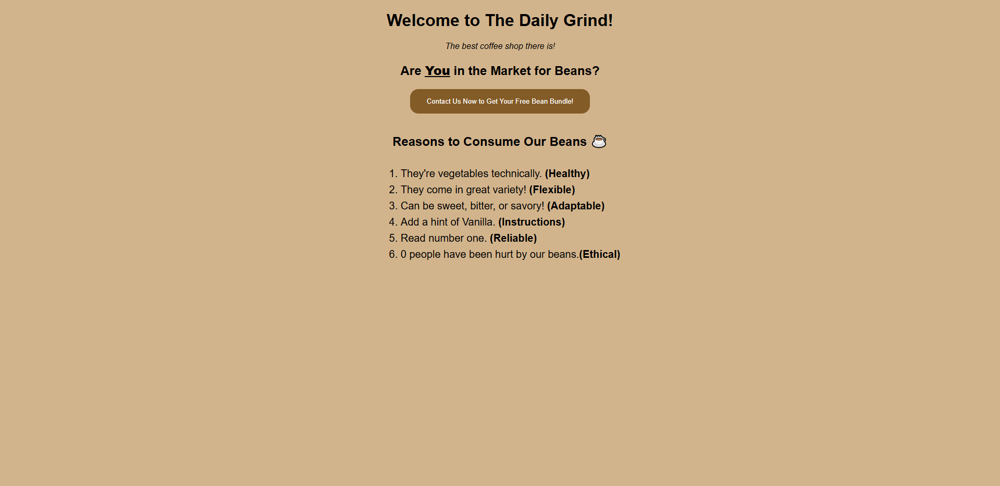
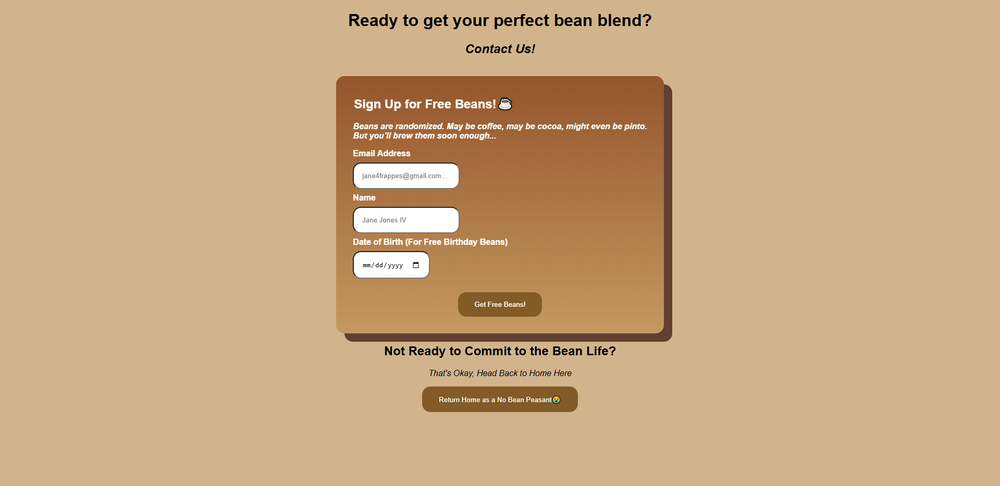

# The Daily Grind ☕ Application
## Module 12 | Lab Overview

The purpose of this project is to build a basic web server using Node.js and Express with a home and contact page. This lab is focused on:

- Set up a Node.js project and manage dependencies.
- Create a basic Express.js server.
- Implement routing to handle specific URL requests.
- Serve static HTML files in response to requests.

------------------------------------------------
## Table of contents

- [Overview](#overview)
  - [GitHub](#github)
  - [How To Use](#how-to-use)
  - [My process](#my-process)
  - [Built with](#built-with)
  - [Reflection Questions](#reflection-questions)
  - [Useful resources](#useful-resources)
- [Author](#author)

### GitHub Link
https://github.com/ANIO-Official/the-daily-grind

### How To Use
1.  Clone the repository or Download the ZIP file and extract the files.
2.  Open the file in Visual Studio Code.
3.  Open the Terminal using Ctrl + ~
4.  cd into the directory 'the-daily-grind' in the terminal.

    **Ensure NPM is is installed for the project to run:** 

      inside the terminal window run npm i to install npm

5.  (Once NPM is indeed installed in the project file directory, you'll see a node modules folder) Run the project using "node server.js" in the terminal.
6.  You should see a message appear. Follow the link: "http://localhost:3000/"





## My process

  Steps brief about process:

 1. Set up the Project: Initialized NPM, Installed Express Package. Added GitIgnore. Initialized Git.

 2. Created HTML Static Web Pages for Home and Contact.

 3. Built the Express Server
    - Imported express library and path module.
    - Created instance of express application.
    - Defined port number.
    - Created route handlers for get request to the root URL and contact page from the public directly.
    - Added console.log message for server startup via listen on port 3000. 
    - Tested in browser, Bug Fix, made adjustments where necessary.

 4. Styled with Vanilla CSS

### Built with

- Node.js
- Express
- JavaScript
- HTML5
- CSS

## Reflection

**What is the difference between res.send() and res.sendFile()? When would you use one over the other?**

res.Send is more so for internal testing. It accepts a simple string to display on response such as 'Hello, World!". In contrast, res.sendFile() accepts the string of a complete file name. To get more specific, you use 

**Why is the path module necessary when serving files? What could go wrong if you just used a relative path like 'public/index.html'?**

The path module is important when serving files to ensure that we are using the absolute path. The path of the public directory can change depending on where you run the node command. Using Node.js's path module in combination with __dirname helps Express know where to find the public directory. Without it, you can encounter an error upon attempting the GET request.

**How would you add a third page (e.g., a menu page) to this server? What steps would you take?**

To add a third page:

 1. Create your HTML Page (e.g., "menu.html") inside the public folder.
 2. Create a new route in server.js using the absolute path of the new page like below:

 ```JS
    //Change from menu to what your page's name is
    app.get('/menu', (req, res) => { //Get request handler
        res.sendFile(path.join(__dirname, 'public/menu.html'))
    }) //to Contact

 ```
 3. Go test the newly created page in the browser. 
    - Run node server.js
    - Click the link to localhost:3000
    - Change the url to localhost:3000/menu
    - (Optional) Add a button in your home and/or contact page for easier access to the menu page without needing to edit the url.

  

### Useful resources

**PerScholas** | Node and Express | Lessons 1-2

**PerScholas** | Bryan Santos - Helped guide me in bug fixing my code when I ran into errors with server setup and fixing issues with styling the webpage by ensuring the middleware was included.

## Author

- LinkedIn - [Amanda Ogletree](https://www.linkedin.com/in/amanda-ogletree-a61b60168)